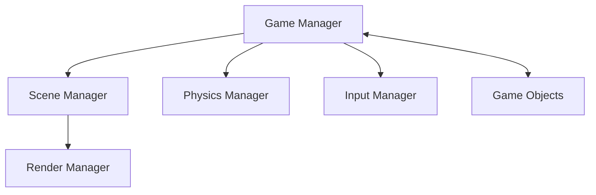

# Game Architecture

This document outlines the technical architecture of the 3D Basketball Swipe Game.

## High-Level Architecture

The game is built using a component-based architecture with Three.js handling the 3D rendering and Ammo.js providing physics simulation. The main components are:



┌─────────────────┐ ┌─────────────────┐ ┌─────────────────┐
│ │ │ │ │ │
│ Game Manager │────▶│ Scene Manager │────▶│ Render Manager │
│ │ │ │ │ │
└────────┬────────┘ └─────────────────┘ └─────────────────┘
│
│
▼
┌─────────────────┐ ┌─────────────────┐ ┌─────────────────┐
│ │ │ │ │ │
│ Physics Manager │◀───▶│ Game Objects │────▶│ Input Manager │
│ │ │ │ │ │
└─────────────────┘ └─────────────────┘ └─────────────────┘

## Core Components

### Game Manager

The central controller that initializes the game and manages the game loop, game states, and score tracking.

```javascript
class GameManager {
  constructor() {
    this.scene = new SceneManager();
    this.renderer = new RenderManager();
    this.physics = new PhysicsManager();
    this.input = new InputManager();
    this.gameObjects = [];
    this.score = 0;
    this.gameState = "idle"; // 'idle', 'aiming', 'shooting', 'scored'
  }

  init() {
    /* Initialize game components */
  }
  update() {
    /* Main game loop */
  }
  reset() {
    /* Reset game state */
  }
}
```

### Scene Manager

Handles the 3D scene setup, including camera, lighting, and environment.

### Physics Manager

Integrates Ammo.js physics with Three.js objects, handling collisions, forces, and constraints.

### Input Manager

Processes touch/mouse events to detect swipes and convert them into game actions.

### Game Objects

#### Ball

The basketball that players interact with. Properties include position, velocity, mass, and bounciness.

#### Hoop

The basketball hoop with a rim and net that detects when a ball passes through for scoring.

#### Backboard

The surface behind the hoop that the ball can bounce off of.

## Rendering Pipeline

The rendering pipeline is responsible for rendering the game objects in the 3D scene. It is built using Three.js and Ammo.js.

- Scene setup with Three.js
- Physics world initialization with Ammo.js
- Game objects created and added to both Three.js scene and Ammo.js physics world
- Game loop runs at 60fps:
  - Process input
  - Update physics
  - Update object positions based on physics
  - Render scene
  - Check for scoring conditions

## State Management

The game uses a simple state machine to manage different phases:

- IDLE: Ball is waiting to be shot
- AIMING: Player is touching/swiping the ball
- SHOOTING: Ball is in motion after a shot
- SCORED: Ball has gone through the hoop
- RESET: Preparing for the next shot

## Performance Considerations

- Use low-poly models with detailed textures
- Implement object pooling for balls if multiple shots are allowed
- Use requestAnimationFrame for smooth rendering
- Optimize physics calculations by adjusting time steps
